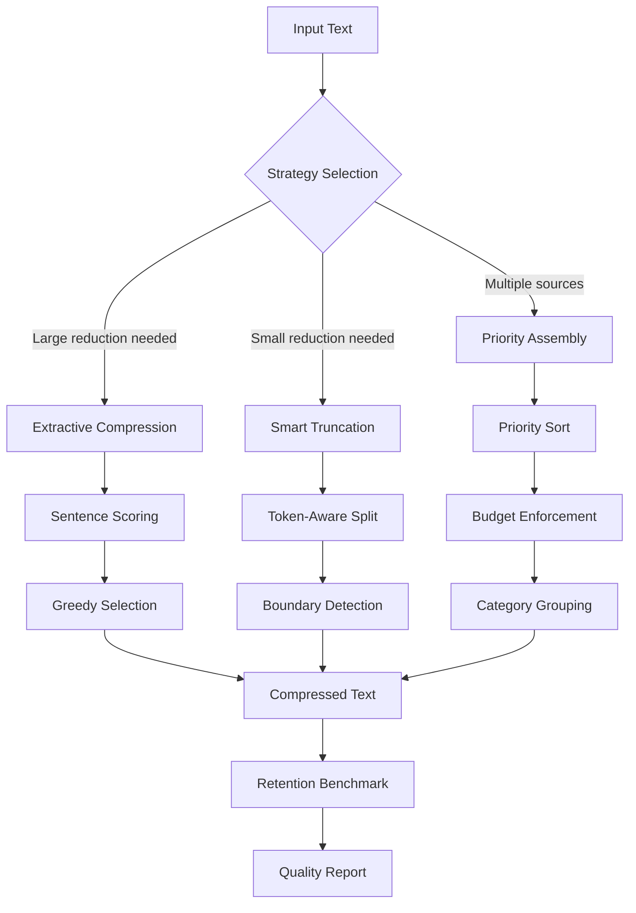
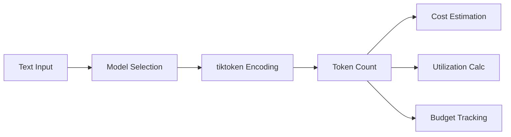
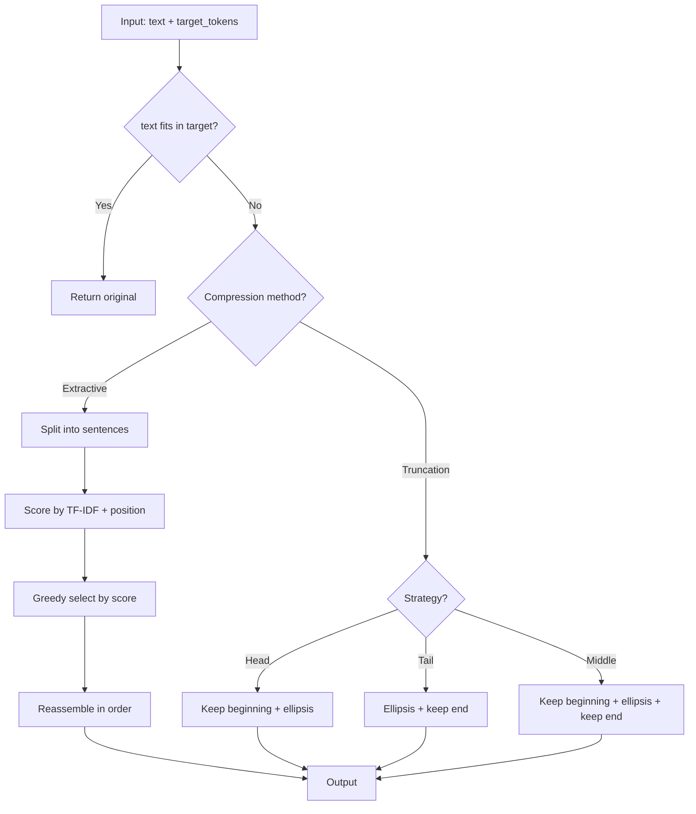
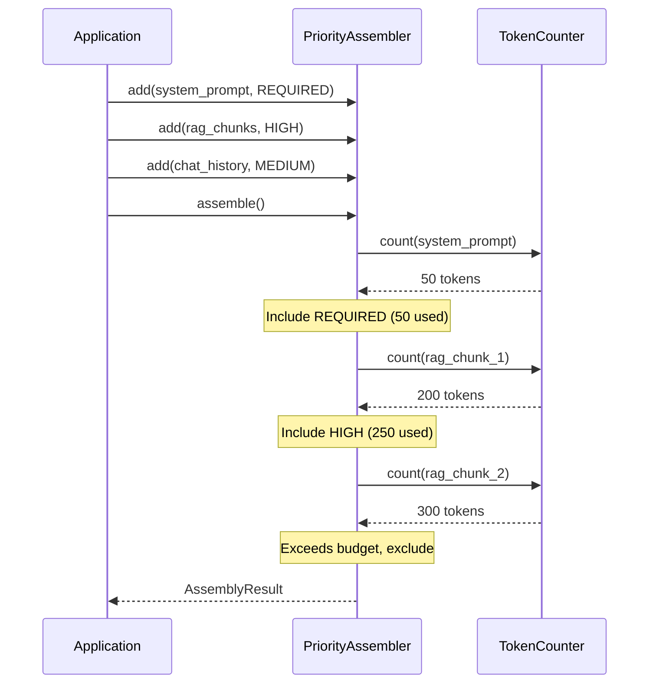

# Architecture

## System Overview

## Token Counting Pipeline

## Compression Decision Flow

## Context Assembly for RAG

## Design Principles

1. **Token-first thinking**: Every operation is token-aware, not character-aware
2. **Budget before build**: Plan token allocation before assembling context
3. **Measure everything**: Retention benchmarks prove compression quality
4. **Model-aware**: Different models tokenize differently and cost differently
5. **Composable**: Each component works independently or together
